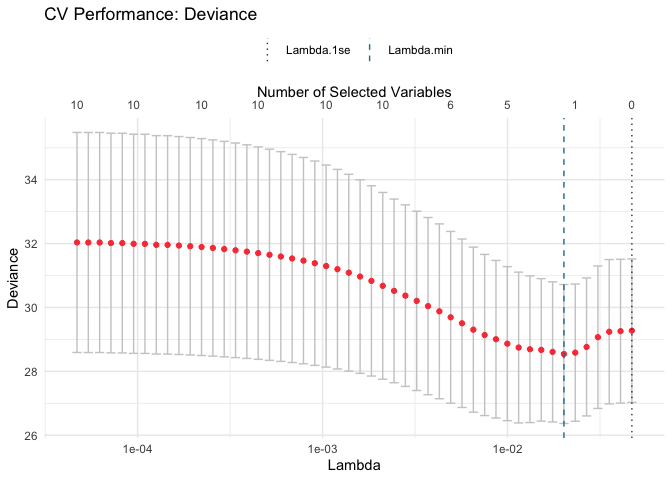
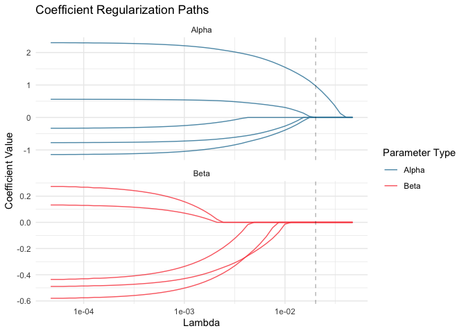
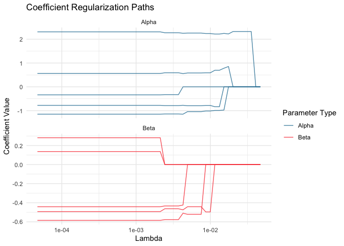

<!-- README.md is generated from README.Rmd. Please edit that file -->

# rbrm: Regularized Binary Regression Models for Relative Risk

<!-- badges: start -->

<!-- badges: end -->

## Overview

`rbrm` provides a comprehensive framework for estimating **relative
risks** (RR) using penalized binary regression models. Unlike
traditional logistic regression (which estimates odds ratios), this
package directly models relative risk through a novel log odds-product
parameterization, avoiding the limitations of Poisson regression that
can produce invalid probabilities.

## Installation

You can install the development version from
[GitHub](https://github.com/JavierMtzRdz/rbrm):

``` r
# Install remotes if needed
# install.packages("remotes")
remotes::install_github("JavierMtzRdz/rbrm")
```

## Quick Start

``` r
library(rbrm)

# Simulate data
set.seed(123)
n <- 200
p <- 5

data <- generate_data(
  n = n,
  pa = p,
  pb = p)

# Fit regularized model (Penalized)
fit <- rbrm(
  va = data$v.train,
  vb = data$v.train,
  x = data$x.train,
  y = data$y.train,
  lambda = 0.02,
  adjusted = FALSE
)

fit
#> ── RBRM Model Fit ──────────────────────────────────────────────────────────────
#> 
#> ℹ Lambda: 0.0200
#> ℹ Features (Alpha): 6
#> ℹ Features (Beta): 6
#> 
#> Coefficients:
#> → Alpha Intercept: -0.350
#> → Alpha Non-zero (Penalized): 1
#>    V2=1.242
#> → Beta Intercept: -4.422
#> → Beta Non-zero (Penalized): 0

# Cross-validation with custom metric and adjusted final model
cv_fit <- cv_rbrm(
  data$v.train,
  vb = data$v.train,
  x = data$x.train,
  y = data$y.train,
  measure = "deviance" # Options: deviance, auc, brier, misclass
)
#> ℹ Generating lambda sequence...
#> ✔ Generated 50 lambdas (Max: 0.047)
#> ℹ Using Deviance as primary selection metric
#> Running Cross-Validation ■■■■■■■■■■■■■                     40% | ETA:  9sRunning Cross-Validation ■■■■■■■■■■■■■■■■■■■               60% | ETA:  8sRunning Cross-Validation ■■■■■■■■■■■■■■■■■■■■■■■■■         80% | ETA:  4s                                                                          ✔ CV Complete. Min Lambda: 0.02018
#> ℹ Fitting adjusted final model (unpenalized refit)...

cv_fit
#> ── RBRM Cross-Validation ───────────────────────────────────────────────────────
#> 
#> ℹ Folds: 5
#> ℹ Lambda Path Length: 50
#> ℹ Measure: Deviance
#> ℹ Refit Unpenalized: Yes
#> ℹ Optimizer: fista
#> 
#> ── Optimal Lambdas ─────────────────────────────────────────────────────────────
#> ★ Min Lambda: 0.0202 (Deviance: 28.54)
#> ★ 1-SE Lambda: 0.0470
#> 
#> ── Final Model (at Lambda Min) ─────────────────────────────────────────────────
#> → Active Va Coeffs (Penalized): 1
#> → Active Vb Coeffs (Penalized): 0
plot(cv_fit)
```



``` r
cv_fit$final_fit
#> ── RBRM Model Fit ──────────────────────────────────────────────────────────────
#> 
#> ℹ Lambda: 0.0202
#> ℹ Features (Alpha): 5
#> ℹ Features (Beta): 5
#> 
#> Coefficients:
#> → Alpha Intercept: -0.201
#> → Alpha Non-zero (Penalized): 1
#>    V2=2.323
#> → Beta Intercept: -4.622
#> → Beta Non-zero (Penalized): 0

# Fit relaxed regularization path (no refitting)
fit_path <- rbrm(
  va = data$v.train,
  vb = data$v.train,
  x = data$x.train,
  y = data$y.train,
  adjusted = FALSE
)

fit_path
#> ── RBRM Regularization Path ────────────────────────────────────────────────────
#> 
#> ℹ Lambdas: 50
#> ℹ Range: 0.0000 - 0.0470
#> ℹ Optimizer: fista
#> ℹ Intercept: Included
#> ℹ Features (Alpha): 5
#> ℹ Features (Beta): 5
plot(fit_path) +
  geom_vline(xintercept = cv_fit$lambda_min,
             alpha = 0.3, linetype = "dashed")
```



``` r

# Fit relaxed regularization path (Unpenalized Refitting)
fit_path <- rbrm(
  va = data$v.train,
  vb = data$v.train,
  x = data$x.train,
  y = data$y.train,
  adjusted = TRUE
)

fit_path
#> ── RBRM Regularization Path ────────────────────────────────────────────────────
#> 
#> ℹ Lambdas: 50
#> ℹ Range: 0.0000 - 0.0470
#> ℹ Type: Relaxed (Unpenalized Refit)
#> ℹ Optimizer: fista
#> ℹ Intercept: Included
#> ℹ Features (Alpha): 5
#> ℹ Features (Beta): 5
plot(fit_path) 
```



## The Model

This package implements the Richardson-Robins-Wang (2017) binary
regression model for relative risk:

- **Outcome Model**: $P(Y=1 \mid X, W, Z) = p_1$ if $X=1$, $p_0$ if
  $X=0$
- **RR Parameterization**: $\log(\text{RR}) = \theta = W^\top \alpha$
  (treatment effect)
- **Baseline Risk**: $p_0$ via log odds-product $\phi = Z^\top \beta$

The model directly estimates relative risk while ensuring valid
probabilities $(0 \leq p_0, p_1 \leq 1)$.

### Regularization

Supports L1 (lasso) and elastic net penalties for high-dimensional data:

- Variable selection when $p > n$
- Separate penalties for $\alpha$ and $\beta$ parameters
- Unpenalized intercept option

## Available Optimizers

1.  **FISTA** (default): Fast proximal gradient with momentum and
    adaptive restart
2.  **Newton-CD**: Coordinate descent with Newton steps and diagonal
    Hessian
3.  **Active Set Newton-CD**: Efficient for sparse solutions via KKT
    conditions
4.  **L-BFGS**: Quasi-Newton method (best for low-dimensional,
    unpenalized problems)

## References

Richardson, T. S., Robins, J. M., & Wang, L. (2017). On modeling and
estimation for the relative risk and risk difference. *Journal of the
American Statistical Association*, 112(519), 1121-1130.
[arXiv:1510.02430](https://arxiv.org/abs/1510.02430)

## Acknowledgments

This package extends the original
[regularized-RR-regression](https://github.com/ChloeYou/regularized-RR-regression)
implementation and builds upon the
[`brm`](https://github.com/mclements/brm) package.

## License

GPL (\>= 2)
